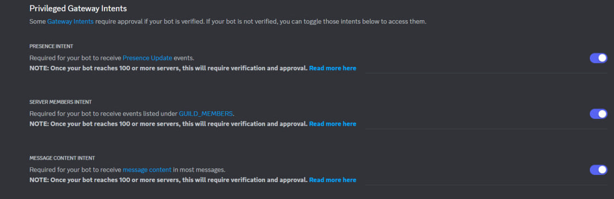
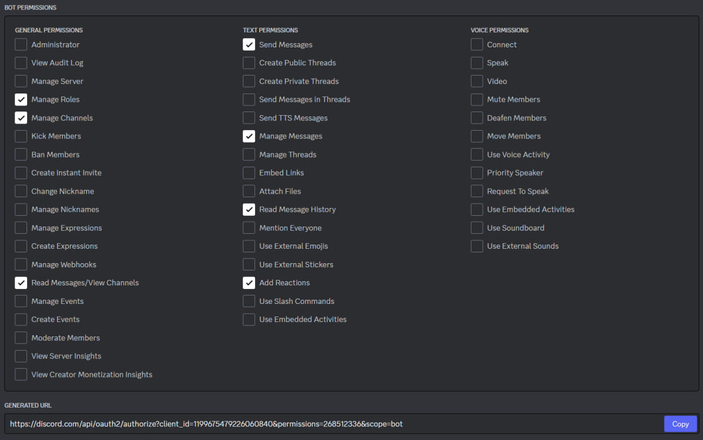
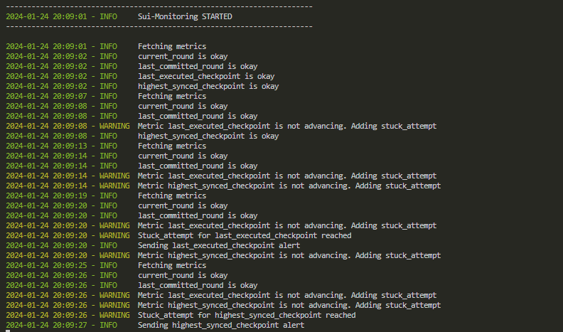
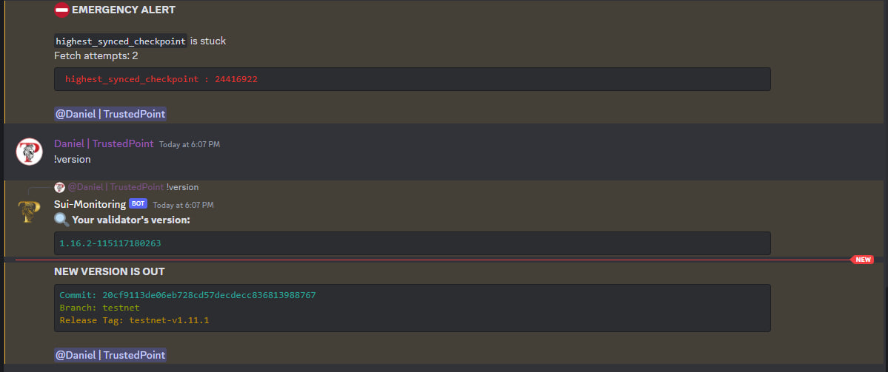

# Sui Alerting Discord Bot

The Sui Alerting Discord Bot is a monitoring and alerting bot designed for validator monitoring.

## Overview

This Discord bot fetches metrics from a Prometheus Validator port, tracks changes in specific metrics, and sends alerts to a specified channel when certain conditions are met as well as checking new upgrade announcements on Sui server.

- You will be alerted when new upgrade is announced
- You will be alerted when server is not responding
- The bot monitors the following metrics available at ip:9184/metrics:
```bash
- last_committed_round
- highest_received_round
- current_round
- last_executed_checkpoint
- highest_synced_checkpoint
```
- You will be alerted if some metrics are stuck for some time and not advancing
  
## Setup

1. **Create a [Discord bot](https://discordpy.readthedocs.io/en/stable/discord.html)**
2. **Do not forget to enable the following permissions:**
   

3. Add the bot to your servr by using OAuth2 URL Generator with the following parameters:
   

4. **Create 2 channels on your server:**
   - One is required for the bot to post alerts and listen to commands.
   - Forward announcements from the Sui server to the second channel.
   
5. **Install dependencies:**
```bash
sudo apt update
sudo apt install python3 git
git clone https://github.com/trusted-point/sui-monitoring-bot.git
pip install -r sui-monitoring-bot/requirements.txt
```
5. **Get bot's token and past it to bot_token.txt**
```bash
nano sui-monitoring-bot/bot_token.txt
```
6. **Edit config.yaml with your user_id and channel ids**
```bash
nano sui-monitoring-bot/config.yaml
```
7. **Create s service file**

```bash
sudo tee /etc/systemd/system/sui-bot.service > /dev/null <<EOF
[Unit]
Description=Sui Discord Bot
After=network.target

[Service]
User=$USER
Type=simple
WorkingDirectory=$HOME/sui-monitoring-bot
ExecStart=python3 $HOME/sui-monitoring-bot/main.py
Restart=on-failure

[Install]
WantedBy=multi-user.target
EOF
```
8. **Start the bot**
```bash
sudo systemctl daemon-reload && \
sudo systemctl enable sui-bot && \
sudo systemctl restart sui-bot && \
sudo journalctl -u sui-bot -f -o cat
```
9. **You should see logs like this**


1. **The bot will alert you if metrics are stuck or not presented**
